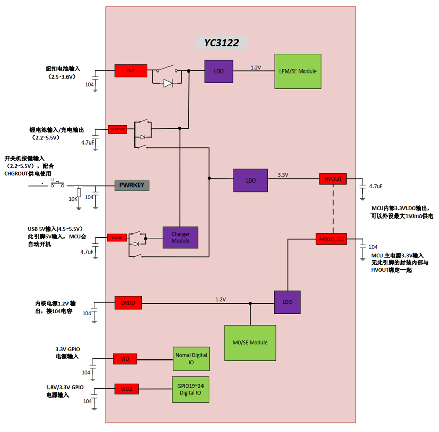

## 第1讲 PWR

### PWR简介

电源控制PWR(Power Controller)主要涉及芯片的供电系统、电源管理器和低功耗模式等功能。

### 1.1 供电系统

芯片有5个电源输入口：

CHGRIN 作为 ChargerModule (充电模块)的输入，也作为内部LDO的输入。

CHGROUT 作为 ChargerModule 的输出，也作为内部 LDO 的输入。

VBUT 作为备份域LDO输入。

VIO 作为IO工作电源输入。

VIO2 作为特殊IO工作电源输入。

4个电源输出口：

HVOUT：作为内部LDO3.3v 输出 与内部MCU主电源输入AVDD33_SEC 绑定一起。

DVDD：作为core ldo 的输出，给芯片内核，内存，OSC192M，PLL，及外设模块供电。

VDDLPM: 作为备份域 ldo的输输出，给备份域内存，OSC32K，Sensor，Tamper供电。

### 1.2 低功耗模式

芯片有3种低功耗模式：包括浅睡模式，深睡模式，关机模式。

#### 浅睡模式

DVDD 域以低压低功耗模式工作，cpu进入睡眠模式(WFI)，内存，外设都以低功耗模式工作，所有的IO引脚都保持在设置的状态，中断事件发生后，睡眠模式立即唤醒，继续工作。

#### **深睡模式**

DVDD 域被切断，RC192M震荡器被关闭，RAM和寄存器内容丢失，只有备份域的模块继续工作，事件唤醒后芯片将复位。

#### **关机模式**

HVOUT稳压器被关闭，只有备份域的模块继续工作。

### 1.3 功耗数据

一般根据最低电源消耗，最快启动时间和可用的唤醒源等条件，选择一种最佳的低功耗模式。相关参数可以参考各系列对应的数据手册，如下数据从数据手册摘取。

#### 典型电流消耗

| 模式     | 状态                                                      | 主电源功耗 | 备份域功耗 |
| -------- | --------------------------------------------------------- | ---------- | ---------- |
| 运行模式 | 常温,dvdd1.4v,mcu clk48MHz                                | 8.57ma     | 0.2ua      |
| 浅睡模式 | 常温,dvdd1.2v,mcu clk12M,关闭所有外设clk,设置powkey高唤醒 | 1.7ma      | 0.2ua      |
| 深睡模式 | 常温,备份域传感器全开,DVDD域下电,设置RTC/IO高电平唤醒     | 7ua        | 0.2ua      |
| 关机模式 | 常温,备份域传感器全开,Hvout下电                           | 1.7ua      | 0.2ua      |

#### 典型唤醒时间

| 模式     | 状态               | 时间 |
| -------- | ------------------ | ---- |
| 浅睡模式 | powerkey高电平唤醒 | 2us  |
| 深睡模式 | GPIO高电平唤醒     |      |
| 关机模式 | powerkey高电平开机 |      |

### 1.4 典型休眠示例
