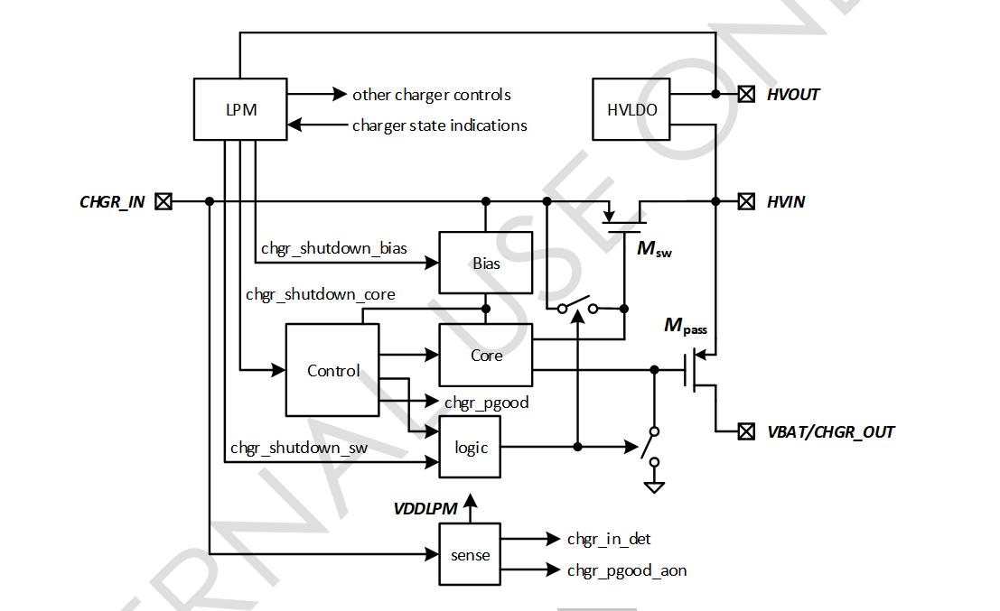
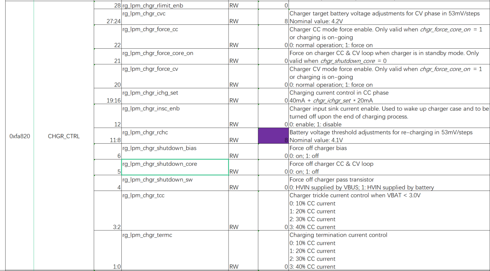
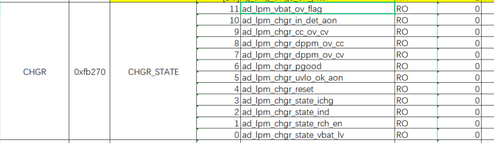
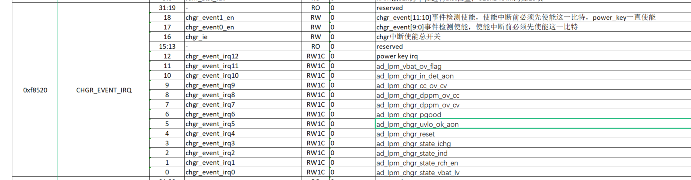
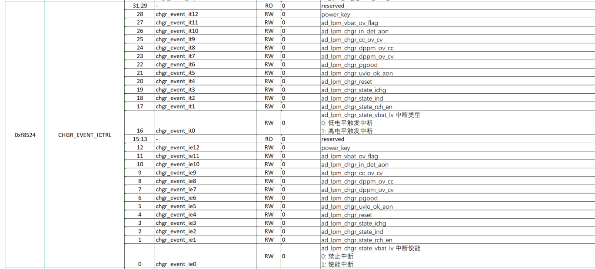
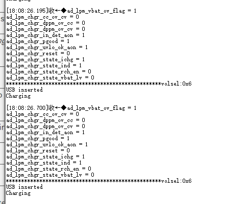

## Charger

### Charger简介

 YC3122 充电支持以下功能 ：

* 集成电源路径，即使电池完全放电，也能在插入时立即打开系统
* 为系统供电，同时对电池进行独立充电
* 软件可配置功能，独立设置充电电流，截止电压及再充电压阀值

### 工作原理



充电器由4个主要块组成：

1. Bias偏置器:产生参考电压和内部2.5V电源，用于控制器和核心模块
2. Sensor CHGR_IN监控器(Sensor 由VDDLPM(备份电源域)供电)

   * 当CHGR_IN大于1.2V (in_det(0xfb270 bit10)=1)时，表示充电器已接入
   * 当CHGR_IN大于4.3V (pgood_aon(0xfb270 bit6)=1)时，表示充电器已激活
3. Core: 执行CV(恒压)/CC(恒流)充电
4. Control 控制器:由各种比较器组成，监测CHGR_IN/VBAT电压和充电电流

   * 当VCHGR_IN > 4.3V和VCHGR_IN > VBAT + 0.4V (pgood = 1)时，决定HVIN连接到CHGR_IN或VBAT。
   * 当pgood = 1且VBAT < 4.1V(可编程，再充电压)时才开始充电循环，给出相应的充电信号

其它charger 控制寄存器在 LPM域下：

1. 通过设置chgr_shutdown_sw (0xfa820 bit4 置1)，Msw关闭，系统切换到VBAT供电
2. 通过设置chgr_shutdown_bias(0xfa820 bit6 置1)关闭偏置块,即关掉充电系统，减小5v总输入的电流消耗
3. 充电完成时，控制逻辑Core关闭()，Mpass关闭。HVIN仍由CHGR_IN提供，控制模块保持电池电压。一旦CHGROUT低于预设值(4.1V标称，可通过chgr_rchc编程)，core将被打开，Mpass打开，为电池充电。chgr_shutdown_core(0xfa820 bit5 置1，强制关闭Mpass)

### 核心寄存器说明

控制寄存器



模拟状态寄存器



描述:

11	ad_lpm_vbat_ov_flag: 暂无作用

10	ad_lpm_chgr_in_det_aon : chgrin 插入检测(0:VCHGR_IN < 3V; 1: VCHGR_IN > 3V)

9	ad_lpm_chgr_cc_ov_cv：当前充电状态（0: 恒压充电；1:恒流充电）

8	ad_lpm_chgr_dppm_ov_cc：暂无作用

7	ad_lpm_chgr_dppm_ov_cv：暂无作用

6	ad_lpm_chgr_pgood：chgrin 电压状态（0: VCHGR_IN < 4.3V或VCHGR_IN < VBAT + 0.4V; 1: vchgr_in > 4.3v & vchgr_in > vbat + 0.4v）状态为0时，偏置器Bias关闭

5	ad_lpm_chgr_uvlo_ok_aon：暂无作用

4	ad_lpm_chgr_reset：暂无作用

3	ad_lpm_chgr_state_ichg：充电电流状态（0：低于配置的恒压充电电流，1：高于配置的恒压充电电流）

2	ad_lpm_chgr_state_ind：充电状态（0: 结束充电，1：正在充电）

1	ad_lpm_chgr_state_rch_en: 再充电压状态 （0：VBAT电压高于配置的再充电压，1：VBAT低于配置的再充电压）

0	ad_lpm_chgr_state_vbat_lv：VBAT是否在3.0 V以下状态 (0:3.0v以上，1:3.0v以下)

充电中断事件状态寄存器(bit0-12) & 总中断开关使能寄存器(bit16-18)



充电中断事件使能寄存器



### 校准

* **校准原理**
  在基准源hvout3.3 准的条件下，调整截止电压配置，校准恒压充电阈值；
* **硬件设置**
  充电器电源chgrin(5v输入)，chgrout负载400欧电阻，chgrout电压为待测电压；
* **软件设置**
  ```
  /*将充电电流设置最小,避免内阻造成误差,并使能一直充电*/
  *(volatile uint8_t*)(0xfa820) = 0;//涓流电流
  *(volatile uint8_t*)(0xfa822) = 0x20;//恒流电流,使能一直充电
  /*调整截止电压与再充电压配置,读取待测电压值在4.21~4.27间,即为校准值写入otp*/
  *(volatile uint8_t*)(0xfa821) = x;
  *(volatile uint8_t*)(0xfa823) = x;
  ```

### 典型示例

* **代码实现**

  ```
  /*使能充电中断总开关*/
  CHGR_Irq_En(ENABLE);
  /*充电事件监测使能*/
  CHGR_Event_Detect_En(CHGR_EVENT_ALL,ENABLE);
  /*配置充电事件触发中断类型*/
  CHGR_Event_Irq_Type(EVENT12_POWER_KEY,CHGR_HIGH_LEVEL);
  /*使能中断事件*/
  CHGR_Event_En(EVENT_ALL,ENABLE);
  /*打开Msw,系统使用chgrin供电*/
  CHARGE_SystemPowerSelect(POWER_CHGR_IN);
  /*配置恒流充电电流*/
  CHARGE_CurSel(CHARG_CURRENT_40MA);//vbat < 3.0v时的电流
  /*配置涓流充电电流*/
  CHARGE_TrickleCurrent(TRICKLE_CURRENT_40);//配置为恒流充电电流的40%
  /*配置恒压充电电流*/
  CHARGE_TerminationCurrent(TRICKLE_CURRENT_40);//配置为恒流充电电流的40%
  /*配置截止充电电压*/
  CHARGE_CutOffVolSel(OVERVOLTAGE_4200MV);
  /*配置再充电压*/
  CHARGE_RechargeVolSel(STARTVOLTAGE_4047MV);
  /*打开充电事件使能开关*/
  *(volatile uint32_t*)(0xf8524) = 0xFFFFFFFF;
  *(volatile uint32_t*)(0xf8520) |= (0x07 << 16);

  ```
* **下载调试结果(读取充电状态，当前处于恒压充电中)**

  

### 软件控制charger实现充电模式说明

* **基本原理**

  * 依赖定时中断中adc检测chgrout电压，去使能或关闭充电模块
    * 使能充电：配置的最大输出电流，开启强制充电
    * 关闭充电：配置的最小输出电流，配置最低的截止电压，达到充满效果
