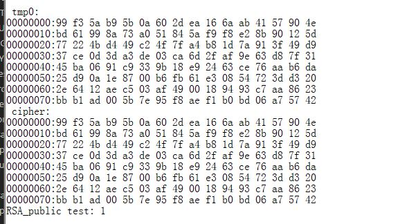
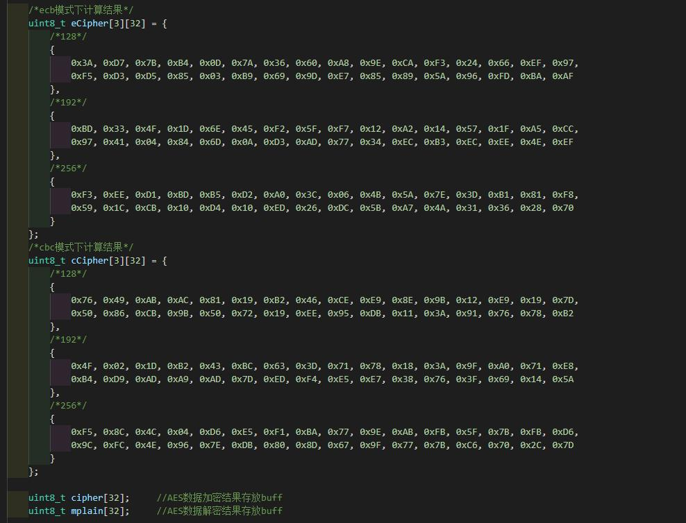
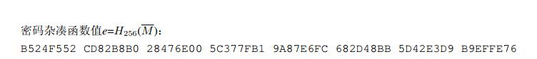

# Crypt

## SHA

### 哈希算法简介

哈希算法(Hash Algorithm)又称散列算法、散列函数、哈希函数，是一种从任何一种数据中创建小的数字“指纹”的方法。哈希算法将数据重新打乱混合，重新创建一个哈希值。

### 库结构体说明

```
SHA 类型枚举
typedef enum
{
SHATYPE_1 = 0,
SHATYPE_224 = 1,
SHATYPE_256 = 2,
SHATYPE_384 = 3,
SHATYPE_512 = 4,
SHATYPE_SM3 = 5
}SHA_ModeTypeDef;
参数说明：
SHATYPE_1：测试类型为 SHA160
SHATYPE_224：测试类型为 SHA224
SHATYPE_256：测试类型为 SHA256
SHATYPE_384：测试类型为 SHA384
SHATYPE_512：测试类型为 SHA512
SHATYPE_SM3：测试类型为 SM3
```

```
SHA 结构体，该结构体支持多组数据同时运算：
typedef struct SHA
{
uint32_t SHA_Data[16]; // 用来保存 SHA_RESULT 寄存器的值
uint8_t SHA_Digest_Length; // SHA 类型加密后的数据长度
uint8_t SHA_CBlock; // SHA 类型数据块大小
uint32_t SHA_LEN; // 数据实时长度
uint8_t SHA_Mode; // SHA 模式
uint8_t SHA_Ctrl; // 数据 bit 位是否超过 1024，控制寄存器用
} SHA_CTX;
```

### SHA运算函数

```
函数原型： t uint32_t f SHA(SHA_ModeTypeDef mode, t uint8_t , *output, uint8_t
t *input,uint32_t ibytes);
功能说明：数据 SHA 计算函数接口；
参数说明：mode ：哈希计算类型： SHA_160/SHA_224/SHA_256/SHA_384/SHA_512；
	Output ：哈希输出数据缓冲区；
	input ：输入数据缓冲区；
	ibytes ：输入数据缓冲区长度；
返回值：RET_ SHA_SUCCESS 计算成功；
	RET_ SHA_MODE_ERR 输入计算类型错误；
	RET_ SHA_BUSY 硬件单元处于忙状态；
```

### 哈希分段运算

```
函数原型：
t uint32_t f sha_first(SHA_ModeTypeDef t mode,uint8_t t *output,uint8_t *input,uint32_t
ibytes);
t uint32_t f sha_mid(SHA_ModeTypeDef t mode,uint8_t t *output,uint8_t *input,uint32_t
ibytes);
t uint32_t f sha_last(SHA_ModeTypeDef t mode,uint8_t t *output,uint8_t *input,uint32_t
ibytes);
功能说明：数据 SHA 计算函数接口，内部增加安全处理；
参数说明：mode ：哈希计算类型： SHA_160/SHA_224/SHA_256/SHA_384/SHA_512；
	Output：哈希输出数据缓冲区；
	input ：输入数据缓冲区；
	ibytes：输入数据缓冲区长度；
返回值：RET_ SHA_SUCCESS 计算成功
	RET_ SHA_MODE_ERR 输入计算类型错误；
	RET_ SHA_BUSY 硬件单元处于忙状态；
```

### 多组运算(可插入中间值)

```
函数原型：uint32_t SHA_Init(SHA_CTX *c,SHA_ModeTypeDef mode);
功能说明：初始化 SHA 数据结构体
参数原型：SHA_CTX *c ：初始化 sha 数据参数保存区
SHA_ModeTypeDef mode： 哈希计算类型
返回值：RET_SHA_INIT_TRUE
函数原型: uint32_t SHA_Update(SHA_CTX *c,uint8_t *input,uint32_t ibytes)
功能说明: 数据 SHA 计算函数接口
参数原型: SHA_CTX *c ：初始化 sha 数据参数保存区
input ：输入数据缓冲区返回值;
ibytes ：输入数据缓冲区长度;
返回值：RET_SHA_SUCCESS
函数原型: uint32_t SHA_Final(SHA_CTX *c,uint8_t *output)
功能说明:输出 SHAHASH 计算值
参数原型: SHA_CTX *c ：初始化 sha 数据参数保存区
output ：哈希输出数据缓冲区；
返回值: RET_SHA_SUCCESS
```

### 典型示例

#### SHA_TEST

**注意：SHA 接口输入输出数据为大端数据**
以下为 SHA 计算 Demo:
Step：
1.定义 SHA 工具计算得出的已知不同计算方法的哈希值 cc1_160…cc1_512
2.调用 SHA(…)接口计算 SHA 值
3. 接口计算的哈希值与工具计算出的进行比较来验证接口
源码路径：.\ModuleDemo\CryptTest\SHA_TEST。


串口输出 log：


#### SHA分段运算

**注意：SHA 接口输入输出数据为大端数据**
以下为 SHA 分段运算 Demo:
Step：
1.定义 SHA 工具计算得出的已知不同计算方法的哈希值 cc1_160…cc1_512
2.调用分段运算的接口运算出哈希值
3. 接口计算的哈希值与工具计算出的进行比较来验证接口
源码路径：.\ModuleDemo\CryptTest\SHA_ENHNCE。
工具计算出的 HASH 值：


HASH 值比较：


串口输出 log：


#### SHA多组运算

**注意：SHA 接口输入输出数据为大端数据**
以下为 SHA 多组数据运算 Demo:
Step：
1.定义 HASH 数组，通过随机数生成
2.调用 SHA 函数接口和 SHA 分组运算函数接口计算出哈希值
3.对比两者数据，比较后返回比较值，输出 log
源码路径：.\ModuleDemo\CryptTest\SHA_TEST。


串口输出 log：


### FEQ常见问题

#### sha1接口传入长度为0得到的结果跟预期的结果不一样

长度为0的计算直接使用 SHA 函数计算，分段计算的函数未做处理。

#### 分段计算哈希时SHA_Update这个接口对输入数据长度有什么要求没？

hash 数据长度超过 **cBlock** 字节 每次按照**cBlock**字节进行 ，最后不足**cBlock**字节的长度按照len%**cBlock**传入

```
CBlock = (mode == SHATYPE_SM3 || mode == SHATYPE_1 || mode == SHATYPE_256 || mode == SHATYPE_224) ? 64 : 128;
```

## RSA

### RSA算法简介

rsa 是一个非对称加密算法，非对称加密算法中，有两个密钥：公钥和私钥。它们是一对，如果用公钥进行加密，只有用对应的私钥才能解密；如果用私钥进行加密，只有用对应的公钥才能解密。

### RSA 库参数说明

#### RSA 私钥结构体1

```
typedef struct
{
uint32_t bytes;
uint8_t e[4];
uint8_t p[MAX_RSA_PRIME_BYTES];
uint32_t p_xor;
uint8_t q[MAX_RSA_PRIME_BYTES];
uint32_t q_xor;
uint8_t n[MAX_RSA_MODULUS_BYTES];
uint8_t d[MAX_RSA_MODULUS_BYTES];
uint8_t dp[MAX_RSA_PRIME_BYTES]; //d mod (p-1)
uint8_t dq[MAX_RSA_PRIME_BYTES]; //d mod (q-1)
uint8_t qp[MAX_RSA_PRIME_BYTES]; //q^-1 mod p
uint8_t n_c[MAX_RSA_MODULUS_BYTES];
uint8_t n_q[4];
uint8_t p_c[MAX_RSA_PRIME_BYTES];
uint8_t p_q[4];
uint8_t q_c[MAX_RSA_PRIME_BYTES];
uint8_t q_q[4];
}RSA_PrivateKeyTypeDef;
参数说明：
MAX_RSA_PRIME_BYTES： 素数数组最大字节数，其定义值为 128，即素数最宽 1024bits ；
MAX_RSA_MODULUS_BYTES：模数数组最大字节数，其定义值为 256，即模数最宽为
2048bits ；
bytes： RSA 密钥长度字节数，即 RSA 密钥为 bytes * 8bits，由于固
定参数 MAX_RSA_MODULUS_BYTES 的限定，bytes 最大值
为 256 ；
E： RSA 公钥指数 ；
p： RSA 素数 p；
p_xor： Q 异或校验值；
q： RSA 素数 q；
q_xor： Q 异或校验值；
n： RSA 模数 n；
d： RSA 私钥指数；
dp： dmod (p - 1)；
dq： dmod (q – 1)；
qp： q^-1 mod p；
n_c： 模数 n 参数 C，用于 n 的模幂运算；
n_q： 模数 n 参数 Q，用于 n 的模幂运算；
p_c： 模数 p 参数 C，用于 p 的模幂运算；
p_q： 模数 p 参数 Q，用于 p 的模幂运算；
q_c： 模数 q 参数 C，用于 q 的模幂运算；
q_q： 模数 q 参数 Q，用于 q 的模幂运算；
其中参数 n_c、n_q、p _c、p _q、q _c、q _q 为 RSA 私钥计算必要参数，如果私钥中不包含以上参数，
应用中可以使用 RSA 接口函数 RSA_CompleteKey 或 RSA_GetPrativeKey_C_Q 生成补全。
```

#### RSA 私钥结构体2

```
typedef struct
{
uint32_t bytes;
uint8_t e[4];
uint8_t n[MAX_RSA_MODULUS_BYTES];
}RSA_PublicKeyTypeDef2;
MAX_RSA_MODULUS_BYTES：模数数组最大字节数，其定义值为 256，即素数最宽为 2048bits ；
bytes ： RSA 密 钥 长 度 字 节 数 ， 即 RSA 密 钥 为 bytes * 8bits 由 于 固 定 参 数
MAX_RSA_MODULUS_BYTES 的限定，bytes 最大值为 256 ；
e：RSA 公钥指数
n：RSA 模数 n
```

#### RSA 随机数参数

RSA 加解密函数中均包含两个随机数参数：rng_callback f_rng 和 void *p_rng 。
f_rng ：随机数函数 ；
rand ：接收随机数序列地址 ；
随机数函数中返回值为必须参数，必须返回实际生产的随机数字节数，在 RSA 加解密计算中，会校
验随机数返回值。随机数函数中 p_rng 作为保留参数，以便开发者使用自定义随机数，作为随机数种子参数使用。**随机数用于运算加扰，不参与运算**。

#### RSA 返回值类型

```
#define RET_RSA_RANDNUM_NOT_ACCEPT (('R'<<24)|('R'<<16)|('N'<<8)|('A')) 随机数不被接受
#define RET_RSA_KEYGEN_SUCCESS (('R'<<24)|('K'<<16)|('G'<<8)|('S')) RSA 密钥生成成功
#define RET_RSA_IMPLEMENT_SUCCESS (('R'<<24)|('R'<<16)|('I'<<8)|('S')) 执行成功
#define RET_RSA_IMPLEMENT_ERROR (('R'<<24)|('R'<<16)|('A'<<8)|('E')) 执行失败
#define RET_PRIME_CHECK_PASS (('R'<<24)|('P'<<16)|('C'<<8)|('P')) 素数检查成功
#define RET_PRIME_CHECK_FAIL (('R'<<24)|('P'<<16)|('C'<<8)|('F')) 素数检查失败
#define RET_RSA_SUCCESS (('R'<<24)|('E'<<16)|('R'<<8)|('S')) RSA 计算成功
#define RET_RSA_FAILURE (('R'<<24)|('E'<<16)|('R'<<8)|('E')) RSA 计算失败
```

### RSA 函数接口说明

#### RSA 私钥（CRT ）函数

```
函数原型： uint32_t t RSA_Private_crt(uint8_t , *output, t uint8_t *input ，
f RSA_PrivateKeyTypeDef k *para,rng_callback , f_rng, d void *p_rng);
功能说明： RSA 私钥函数（函数内部使用 CRT 算法实现），使用 RSA 私钥对数据进行解密等操作
参数说明：
output ：输出数据缓冲区的指针（输出参数）,output 指针地址需要按照 uint32_t 类型对齐
input ：输入数据缓冲区的指针（输入参数）；（t input 不能等于 output）
para ：RSA 私钥结构体类型参数（输入参数）；
f_rng ：随机数函数（输入参数）；
p_rng ：随机数函数参数（输入参数）；
返回值：RET_RSA_SUCCESS RSA 计算成功 ；
RET_RSA_FAILURE RSA 计算失败；
```

#### RSA 私钥（非 CRT ）函数

```
函数原型：uint32_t RSA_Private_Func(uint8_t *output,uint8_t *input, RSA_PrivateKeyTypeDef2
*para,rng_callback f_rng, void *p_rng);
功能说明：RSA 私钥函数（函数内部使用 非 CRT 算法实现），使用 RSA 私钥对数据进行解密等操作
参数说明：
output ：输出数据缓冲区的指针（输出参数），output 指针地址需要按照 uint32_t 类型对齐；
input ：输入数据缓冲区的指针（输入参数）；（t input 不能等于 output）
para ：RSA 私钥结构体 二类型参数（输入参数）；
f_rng ：随机数函数（输入参数）；
p_rng ：随机数函数参数（输入参数）；
返回值:RET_RSA_SUCCESS RSA 计算成功 ；
RET_RSA_FAILURE RSA 计算失败；
```

#### RSA 公钥（CRT ）函数

```
函数原型：t uint32_t t RSA_Public(uint8_t , *output, t uint8_t , *input, RSA_PublicKeyTypeDef
*key,k rng_callback , f_rng, d void *p_rng);
功能说明： RSA 公钥函数，使用 RSA 公钥对数据进行加密等操作。
参数说明：
output ： 输出数据缓冲区的指针（输出参数），output 指针地址需要按照 uint32_t 类型
对齐；
input ： 输入数据缓冲区的指针（输入参数）；（t input 不能等于 output）
key ： RSA 公钥（输入参数）；
f_rng ： 随机数函数（输入参数）；
p_rng ： 随机数函数参数（输入参数）；
返回值：RET_RSA_SUCCESS RSA 计算成功
RET_RSA_FAILURE RSA 计算失败
```

#### RSA 公钥（非 CRT ）函数

```
函 数 原 型 ： uint32_t RSA_Public_Func(uint8_t *output, uint8_t *input,
2 RSA_PublicKeyTypeDef2 k *para,rng_callback , f_rng, d void *p_rng);
功能说明： RSA 公钥函数，使用 RSA 公钥对数据进行加密等操作。
参数说明：
output ： 输出数据缓冲区的指针（输出参数），output 指针地址需要按照 uint32_t 类型
对齐；
input ： 输入数据缓冲区的指针（输入参数）；（t input 不能等于 output）
para ： 公钥结构体二类型的公钥（输入参数）；
f_rng ： 随机数函数（输入参数）；
p_rng ： 随机数函数参数（输入参数）；
返回值：RET_RSA_SUCCESS RSA 计算成功
RET_RSA_FAILURE RSA 计算失败
```

#### RSA 密钥生成函数

```
函数原型：uint32_t RSA_GenerateKey(RSA_PrivateKeyTypeDef *key, uint32_t exponent,uint32_t nbits, rng_callback f_rng, void *p_rng);
功能说明： RSA 密钥生成函数，用于生成 RSA 私钥 ,生成的数据为小端模式存储
参数说明:
key ： RSA 私钥指针（输出参数）；
exponent ： RSA 公钥指数（输入参数）；e = 0x10001(65537)
不允许使用比 65537 更低的公钥指数 e
nbits ： RSA 密钥模数比特长度（1024 或 2048）（输入参数）；
f_rng ： 随机数函数（输入参数）；
p_rng ： 随机数函数参数（输入参数）；
返回值：RET_RSA_KEYGEN_SUCCESS RSA 密钥生成成功 ；
RET_RSA_RANDNUM_NOT_ACCEPT 随机数不被接受；
```

#### RSA 私钥（带 d)补全函数

```
函数原型：uint32_t RSA_CompleteKey(RSA_PrivateKeyTypeDef *key, rng_callback f_rng, void
*p_rng);
功能说明： RSA 私钥补全函数，应用中提供 RSA 私钥 p、q、d 及 bytes（密钥字节长度），函
数自动生成符合固件库要求的 RSA 私钥（包括模幂运算参数）。
参数说明：
key ： RSA 私钥指针（输出参数）；
f_rng ： 随机数函数（输入参数）；
p_rng ： 随机数函数参数（输入参数）；
返回值：RET_RSA_KEYGEN_SUCCESS RSA 私钥补全成功 ；
RET_RSA_RANDNUM_NOT_ACCEPT RSA 私钥补全失败；
```

#### RSA 私钥（带 e ）补全函数

```
函数原型：uint32_t RSA_CompleteKey_e(RSA_PrivateKeyTypeDef *key, rng_callback f_rng,
void *p_rng);
功能说明： RSA 私钥补全函数，应用中提供 RSA 私钥 p、q、e 及 bytes（密钥字节长度），函
数自动生成符合固件库要求的 RSA 私钥。
参数说明：
key ： RSA 私钥指针（输出参数）；
f_rng ： 随机数函数（输入参数）；
p_rng ： 随机数函数参数（输入参数）；
返回值：RET_RSA_KEYGEN_SUCCESS RSA 私钥补全成功 ；
RET_RSA_RANDNUM_NOT_ACCEPT RSA 私钥补全失败 ；
```

#### RSA 生成私钥模幂运算参数（C 、Q）函数

```
函数原型：uint32_t RSA_GetPrativeKey_C_Q(RSA_PrivateKeyTypeDef *key, rng_callback f_rng,
void *p_rng);
功能说明：RSA 私钥加解密中，私钥中需要提供 6 个模幂运算参数分别为：
n_c ：模数 n 参数 C，用于 n 的模幂运算；
n_q ：模数 n 参数 Q，用于 n 的模幂运算；
p_c ：模数 p 参数 C，用于 p 的模幂运算；
p_q ：模数 p 参数 Q，用于 p 的模幂运算；
q_c ：模数 q 参数 C，用于 q 的模幂运算；
q_q ：模数 q 参数 Q，用于 q 的模幂运算；
如果私钥中缺少以上参数可以使用 RSA_GetPrativeKey_C_Q 函数生成补全。
参数说明：
key ： RSA 私钥指针（输出参数）；
f_rng ： 随机数函数（输入参数）；
p_rng ： 随机数函数参数（输入参数）；
返回值：RET_RSA_IMPLEMENT_SUCCESS 执行成功；
RET_RSA_IMPLEMENT_ERROR 执行失败；
```

#### RSA 生成公钥模幂运算参数（C 、Q）函数

```
函数原型：uint32_t RSA_GetPublicKey_C_Q(RSA_PublicKeyTypeDef *key, rng_callback f_rng, void
*p_rng);
功能说明：使用 RSA 公钥加解密函数时，密钥结构体中需要提供 2 个模幂运算参数分别为：
n_c ：模数 n 参数 C，用于 n 的模幂运算；
n_q ：模数 n 参数 Q，用于 n 的模幂运算 ；
如果公钥中缺少以上参数需要使用 RSA_GetPublicKey_C_Q 函数生成补全参数。
参数说明：
key ： RSA 公钥指针（输出参数）；
f_rng ： 随机数函数（输入参数）；
p_rng ： 随机数函数参数（输入参数）；
返回值： RET_RSA_IMPLEMENT_SUCCESS 执行成功；
RET_RSA_IMPLEMENT_ERROR 执行失败；
```

#### RSA 素数检测函数

```
函数原型：uint32_t RSA_IsPrime( uint32_t *X, uint32_t size, rng_callback f_rng, void *p_rng);
功能说明：RSA 素数检测函数，判断输入数据的素性。
参数说明：
X ： 大数数组；
size ： 数组的字长度；
f_rng ： 随机数函数（输入参数）；
p_rng ： 随机数函数参数（输入参数）；
返回值：RET_PRIME_CHECK_PASS 判定为素数；
RET_PRIME_CHECK_FAIL 判定非素数；
```

#### RSA 素数生成函数

```
函数原型：t uint32_t ( RSA_GeneratePrime( t uint32_t , *result, t uint32_t , nbits, k rng_callback f_rng,
d void *p_rng);
功能说明：RSA 素数生成函数。
参数说明：
result ： 大数数组输出；
nbits ： 数组的比特长度；
f_rng ： 随机数函数（输入参数）；
p_rng ： 随机数函数参数（输入参数）；
返回值：RET_RSA_IMPLEMENT_SUCCESS 执行成功；
RET_RSA_IMPLEMENT_ERROR 执行失败；
```

### 典型示例

#### 加解密 Demo

**注意：RSA 各接口输入输出全部为小端数据。**
根据 RSA 算法限制，需要注意 RSA 输入的明文数据 m 需要大于 0 小于模数 n
以下为自动生成密钥的加解密的 demo:demo 提供 1024bit 和 2048bit 的秘钥生成。
1024 与 2048bit 加解密验证过程一样，只是传参不同。
Step:

1. 生成密钥 RSA_GenerateKey();
   生成的密钥小端模式存储，利用自定义大小端转换函数 memcpy_r(…)将数据准换成大端然后通过
   自定义函数 printv(…)打印 log 以方便工具验证。
2. 将明文字符串转换成明文数组，并完成大小端转换
3. 公钥加密函数加密 RSA_Public(…);
4. 私钥解密函数 RSA_Private_crt（…）;
   源码路径：.\ModuleDemo\CryptTest\RSA_GENKEY_TEST

接口定义参数说明：
**生成 1024bit key：**


**生成 2048bite key：**


#### 加解密 Demo （带 e）

**注意：RSA 各接口输入输出全部为小端数据**。
根据 RSA 算法限制，需要注意 RSA 输入的明文数据 m 需要大于 0 小于模数 n
以下为自定义 p、q、n、e 数据，然后函数补全 e 的 1024bit 加解密 demo，2048bit 验证过程一样，这是传
参不同
Step:

1. 用自定义数据初始化密钥结构体成员 p、q、n、e，密钥初始化（小端模式数据）利用自
   定义大小端转换函数 memcpy_r(…)将数据准换成小端模式
2. 补全 e ，调用 RSA_CompleteKey_e()函数
3. 加密得到密文并与已知密文比较。
4. 解密比较明文数据。
   源码路径：.\ModuleDemo\CryptTest\RSA_TEST

**自定义参数：**


**接口参数说明：**


**1024 bit 加解密：**


**2048 bit 加解密：**


**1024 公钥加密**



**1024 私钥解密**


**2048 公钥加密**


**2048 私钥解密**


#### 三元组加解密 Demo

**注意：RSA 各接口输入输出全部为小端数据。**
根据 RSA 算法限制，需要注意 RSA 输入的明文数据 m 需要大于 0 小于模数 n
以下为自定义 p、q、n、e 数据，然后函数补全 e 的 1024bit 加解密 demo，2048bit 验证过程一样，只是传
参不同：
Step:

1. 用自定义数据初始化密钥结构体成员 e、n、 d，密钥初始化（小端模式数据）
2. 公钥加密函数 RSA_Public_Func（…）得到密文
3. 私钥解密函数 RSA_Private_Func（…）解密比较明文数据。
   源码路径：. \ModuleDemo\CryptTest\RSA_TRIPLE_TEST


### FEQ常见问题

#### rsa只支持1024和2048吗?

是

#### 这里的私钥文件和公钥文件有格式要求吗？

参考生成RSA密钥对软件及使用说明

## DES

### DES简介

DES算法为密码体制中的对称密码体制，是一个分组加密算法，典型的DES以64位为分组对数据加密，加密和解密用的是同一个算法。

### DES 库参数说明

```
typedef enum
{
ECB = (('P'<<24)|('E'<<16)|('C'<<8)|('B')),
CBC = (('P'<<24)|('C'<<16)|('B'<<8)|('C'))
}PACK_ModeTypeDef;
说明：
ECB ： ECB 分组加密模式
CBC ： CBC 分组加密模式

#define DES_TYPE_DES_ENC (('D'<<24)|('T'<<16)|('D'<<8)|('E')) DES 加密模式
#define DES_TYPE_DES_DEC (('D'<<24)|('T'<<16)|('D'<<8)|('D')) DES 解密模式
#define DES_TYPE_TDES_ENC (('D'<<24)|('T'<<16)|('T'<<8)|('E')) TDES 加密模式
#define DES_TYPE_TDES_DEC (('D'<<24)|('T'<<16)|('T'<<8)|('D')) TDES 解密模式
```

#### DES/TDES 返回值类型

```
#define RET_DES_SUCCESS (('R'<<24)|('D'<<16)|('S'<<8)|('C')) 加密成功；
#define RET_DES_FAILURE (('R'<<24)|('D'<<16)|('F'<<8)|('A')) 加密失败；
#define RET_DES_KEY_IS_OK (('R'<<24)|('D'<<16)|('K'<<8)|('O')) 密钥正确；
#define RET_DES_KEY_IS_NULL (('R'<<24)|('D'<<16)|('K'<<8)|('N')) 密钥指针为空；
#define RET_DES_KEY_CRC_ERROR (('R'<<24)|('D'<<16)|('K'<<8)|('C')) 密钥 CRC 错误；
#define RET_DES_KEY_READBACK_ERROR (('R'<<24)|('D'<<16)|('K'<<8)|('R')) 密钥回读错误；
#define RET_DES_IV_CRC_ERROR (('R'<<24)|('D'<<16)|('I'<<8)|('C')) IVCRC 错误；
#define RET_DES_PACK_MODE_ERROR (('R'<<24)|('D'<<16)|('P'<<8)|('E')) 分组模式错误；
#define RET_DES_OUTBUF_TOO_SMALL (('R'<<24)|('D'<<16)|('O'<<8)|('S')) 输出缓冲不足；
#define RET_DES_INPUT_SIZE_ERROR (('R'<<24)|('D'<<16)|('I'<<8)|('S')) 输入数据 len 错误；
#define RET_DES_RESULT_CHECK_ERROR (('R'<<24)|('D'<<16)|('R'<<8)|('C')) 输出结果错误；
```

#### DES 随机数参数

```
DES 加解密函数中均包含两个随机数参数： rng_callback f_rng 和 void *p_rng
f_rng ：随机数函数；
p_rng ：随机数函数参数；
随机数函数中返回值为必须参数，必须返回实际产生的随机数字节数，在 DES 加解密计算中，
会校验随机数返回值。
随机数函数中 p_rng 作为保留参数，以便开发者使用自定义随机数，作为随机数种子参数使用。
```

### DES 函数接口

#### DES加密

```
函数原型：uint32_t DES_Enc(PACK_ModeTypeDef pack_mode,uint8_t *output, uint32_t obytes,uint8_t *input, uint32_t ibytes,DES_KeyTypeDef key, DES_IvTypeDef iv,rng_callback f_rng, void *p_rng);
功能说明： 使用 DES 方式加密字节数据块。
参数说明：
pack_mode ：分组加密模式： ECB、 CBC；
output ：密文输出缓冲区指针(输出参数)；
obytes ：密文输出缓冲区大小，以 Byte 为单位(输入参数)；
input ：明文输入缓冲区指针(输入参数)；（t input 不能等于 output）
ibytes ：明文输入缓冲区大小，以 Byte 为单位 (输入参数)；
key ：密钥指针(输入参数)；
iv ：初始化向量；
f_rng ：随机数函数；
p_rng ：随机数函数参数；
返回值：
RET_DES_SUCCESS 加密成功；
RET_DES_FAILURE 加密失败；
RET_DES_KEY_IS_NULL 密钥指针为 NULL；
RET_DES_KEY_READBACK_ERROR 密钥回读错误；
RET_DES_PACK_MODE_ERROR 分组模式错误；
RET_DES_OUTBUF_TOO_SMALL 输出缓冲不足；
RET_DES_INPUT_SIZE_ERROR 输入数据大小错误；
RET_DES_INPUT_SIZE_ERROR 输入数据长度错误；
RET_DES_RESULT_CHECK_ERROR 输出结果校验错误；
```

#### DES解密

```
函数原型： uint32_t DES_Dec(PACK_ModeTypeDef pack_mode,
uint8_t *output, uint32_t obytes,
uint8_t *input, uint32_t ibytes,
DES_KeyTypeDef key, DES_IvTypeDef iv,
rng_callback f_rng, void *p_rng);
功能说明： 使用 DES 方式解密字节数据块。
参数说明：pack_mode ：分组加密模式： ECB、 CBC；
output ：明文输出缓冲区指针(输出参数)；
obytes ：明文输出缓冲区大小，以 Byte 为单位(输入参数)；
input ：密文输入缓冲区指针(输入参数)；（t input 不能等于 output）
ibytes ：密文输入缓冲区大小，以 Byte 为单位 (输入参数)；
key ：密钥缓冲指针(输入参数)；
iv ：初始化向量；
f_rng ：随机数函数；
p_rng ：随机数函数参数；
返回值：
RET_DES_SUCCESS 解密成功；
RET_DES_FAILURE 解密失败；
RET_DES_KEY_IS_NULL 密钥指针为 NULL；
RET_DES_KEY_READBACK_ERROR 密钥回读错误；
RET_DES_PACK_MODE_ERROR 分组模式错误；
RET_DES_OUTBUF_TOO_SMALL 输出缓冲不足；
RET_DES_INPUT_SIZE_ERROR 输入数据大小错误；
RET_DES_RESULT_CHECK_ERROR 输出结果校验错误
```

#### TDES 加密

```
函数原型： uint32_t TDES_Enc(PACK_ModeTypeDef pack_mode,
uint8_t *output, uint32_t obytes,
uint8_t *input, uint32_t ibytes, （ （t input 不能等于 output ）
TDES_KeyTypeDef *key, DES_IvTypeDef iv,
rng_callback f_rng, void *p_rng);
功能说明：使用 TDES 方式加密字节数据块。
参数说明：
pack_mode ： 分组加密模式： ECB、 CBC；
output ：密文输出缓冲区指针(输出参数)；
obytes ：密文输出缓冲区大小，以 Byte 为单位(输入参数)；
input ：明文输入缓冲区指针(输入参数)；（t input 不能等于 output）
ibytes ：明文输入缓冲区大小，以 Byte 为单位 (输入参数)；
key ：密钥缓冲指针(输入参数)；
iv ：初始化向量；
f_rng ：随机数函数；
p_rng ：随机数函数参数；
返回值：
RET_DES_SUCCESS 加密成功；
RET_DES_FAILURE 加密失败；
RET_DES_KEY_IS_NULL 密钥指针为 NULL；
RET_DES_KEY_READBACK_ERROR 密钥回读错误；
RET_DES_PACK_MODE_ERROR 分组模式错误；
RET_DES_OUTBUF_TOO_SMALL 输出缓冲不足；
RET_DES_INPUT_SIZE_ERROR 输入数据大小错误；
RET_DES_RESULT_CHECK_ERROR 输出结果校验错误；
```

#### TDES 解密

```
函数原型： uint32_t TDES_Dec(PACK_ModeTypeDef pack_mode,uint8_t *output, uint32_t obytes,
uint8_t *input, uint32_t ibytes, （ （t input 不能等于 output ）
TDES_KeyTypeDef *key, DES_IvTypeDef iv,
rng_callback f_rng, void *p_rng);
功能说明：使用 TDES 方式解密字节数据块。
参数说明：
pack_mode ：分组加密模式： ECB、 CBC；
output ：明文输出缓冲区指针(输出参数)；
obytes ：明文输出缓冲区大小，以 Byte 为单位(输入参数)；
input ：密文输入缓冲区指针(输入参数)；
ibytes ：密文输入缓冲区大小，以 Byte 为单位 (输入参数)；
key ：密钥缓冲指针(输入参数)；
iv ：初始化向量；
f_rng ：随机数函数；
p_rng ：随机数函数参数；
返回值：
RET_DES_SUCCESS 解密成功；
RET_DES_FAILURE 解密失败；
RET_DES_KEY_IS_NULL 密钥指针为 NULL；
RET_DES_KEY_READBACK_ERROR 密钥回读错误；
RET_DES_PACK_MODE_ERROR 分组模式错误；
RET_DES_OUTBUF_TOO_SMALL 输出缓冲不足；
RET_DES_INPUT_SIZE_ERROR 输入数据大小错误；
RET_DES_RESULT_CHECK_ERROR 输出结果校验错误；
```

### 典型示例

#### DES 加解密 DEMO

**注意：DES 接口输入输出数据为大端数据**
以下为 DES ECB 与 CBC 加解密 Demo:
Step：
1.加密函数 DES_Enc(…)加密，得到密文与工具算出的密文比较是否正确
2.解密函数 DES_Dec(…)解密，得到明文数据与工具算出的明文比较是否正确。
需要注意的是，加解密函数的输出 buffer 不能为同一 buffer。
源码路径：.\ModuleDemo\CryptTest\DES_TEST
**接口定义参数说明：**


#### TDES 加解密 DEMO

**注意：DES 接口输入输出数据为大端数据**
以下为 TDES ECB 与 加解密 Demo:
Step：
1.加密函数 TDES_Enc(…)加密，得到密文与工具算出的密文比较是否正确
2.解密函数 TDES_Dec(…)解密，得到明文数据与工具算出的明文比较是否正确。
需要注意的是，加解密函数的输出 buffer 不能为同一 buffer。
源码路径：.\ModuleDemo\CryptTest\DES_TEST

**接口定义参数说明:**


#### 3DES 计算工具比较结果

**ECB 加解密:**


**输出log:**


**CBC 加解密：**


**输出log:**


### FEQ常见问题

#### 16个字节的密钥怎么做TDES?

16个字节的密钥，把密钥3 补成密钥1

## AES

### AES简介

AES的全称是Advanced Encryption Standard，意思是高级加密标准。它的出现主要是为了取代DES加密算法的。

### AES参数说明

```
typedef enum
{
AES_128= 128, //AES128 位模式
AES_192 = 192, //AES192 位模式
AES_256 = 256 //AES256 位模式
}AES_KeySizeTypeDef;
typedef enum
{
ECB = (('P'<<24)|('E'<<16)|('C'<<8)|('B')),
CBC = (('P'<<24)|('C'<<16)|('B'<<8)|('C'))
}PACK_ModeTypeDef;
说明：
ECB ： ECB 分组加密模式
CBC ： CBC 分组加密模式
```

```
#define RET_AES_SUCCESS (('R'<<24)|('A'<<16)|('S'<<8)|('C')) 加密成功；
#define RET_AES_FAILURE (('R'<<24)|('A'<<16)|('F'<<8)|('A')) 加密失败；
#define RET_AES_KEY_IS_NULL (('R'<<24)|('A'<<16)|('K'<<8)|('N')) 密钥为空；
#define RET_AES_KEY_IS_OK (('R'<<24)|('A'<<16)|('K'<<8)|('O')) 密钥正确；
#define RET_AES_KEY_SIZE_ERROR (('R'<<24)|('A'<<16)|('K'<<8)|('S')) 密钥长度错误；
#define RET_AES_PACK_MODE_ERROR (('R'<<24)|('A'<<16)|('P'<<8)|('E')) 分组模式错误；
#define RET_AES_OUTBUF_TOO_SMALL (('R'<<24)|('A'<<16)|('O'<<8)|('S')) 输出缓冲区不足；
#define RET_AES_INPUT_SIZE_ERROR (('R'<<24)|('A'<<16)|('I'<<8)|('S')) 输入数据长度错误；
```

### AES函数接口

#### **AES加密**

```

函数原型：t uint32_t f AES_Enc(PACK_ModeTypeDef pack_mode,
t uint8_t , *output, t uint32_t obytes,
t uint8_t , *input, t uint32_t ibytes,
t uint8_t , *key, f AES_KeySizeTypeDef ksize,
f AES_IvKeyTypeDef iv,
k rng_callback , f_rng, d void *p_rng);
功能说明：使用 AES 方式加密字节数据块；
参数说明：pack_mode ：AES 分组加密模式： ECB、 CBC(输入参数)；
output ：密文输出缓冲区指针(输出参数)；
obytes ：密文输出缓冲区大小，以 Byte 为单位(输入参数)；
input ：明文输入缓冲区指针(输入参数)；
ibytes ：明文输入缓冲区大小，以 Byte 为单位 (输入参数)；
key ：密钥缓冲指针(输入参数)；
kSize ：密钥大小模式： AES_128、 AES_192、 AES_256；
iv ：初始化向量；
f_rng ：随机数函数（输入参数）；
p_rng ：随机数函数参数（输入参数）；
参数要求：1、明文输入字节数必须是 AES 密钥字节数的整数倍且不为 0；
2、 iv 为 NULL，函数按 0x0 处理；
返回值： RET_AES_SUCCESS 加密成功；
RET_AES_KEY_IS_NULL 密钥指针为 NULL；
RET_AES_KEY_SIZE_ERROR 密钥大小错误；
RET_AES_PACK_MODE_ERROR 分组模式错误；
RET_AES_OUTBUF_TOO_SMALL 输出缓冲不足；
RET_AES_INPUT_SIZE_ERROR 输入数据大小错误；
RET_AES_FAILURE 加密失败；
```

#### AES解密

```
函数原型： uint32_tAES_Dec(PACK_ModeTypeDef pack_mode,
uint8_t *output, uint32_t obytes,
uint8_t *input, uint32_t ibytes,
uint8_t *key,AES_KeySizeTypeDef ksize,
AES_IvKeyTypeDef iv,
rng_callback f_rng, void *p_rng);
功能说明： 使用 AES 方式解密字节数据块；
参数说明： pack_mode ： AES 分组加密模式： ECB、 CBC(输入参数)；
output ：明文输出缓冲区指针(输出参数)；
oBytes ：明文输出缓冲区大小，以 Byte 为单位(输入参数)；
input ：密文输入缓冲区指针(输入参数)；
iBytes ：密文输入缓冲区大小，以 Byte 为单位 (输入参数)；
key ：密钥缓冲指针(输入参数)；
kSize ：密钥大小模式： AES_128、 AES_192、 AES_256；
iv ：初始化向量；
f_rng ：随机数函数（输入参数）；
p_rng ：随机数函数参数（输入参数）；
参数要求：
1、密文输入字节数必须是 AES 密钥字节数的整数倍且不为 0；
2、 iv 为 NULL，函数按 0x0 处理；
返回值： RET_AES_SUCCESS 加密成功；
RET_AES_KEY_IS_NULL 密钥指针为 NULL；
RET_AES_KEY_SIZE_ERROR 密钥大小错误；
RET_AES_PACK_MODE_ERROR 分组模式错误；
RET_AES_OUTBUF_TOO_SMALL 输出缓冲不足；
RET_AES_INPUT_SIZE_ERROR 输入数据大小错误；
RET_AES_FAILURE 加密失败；
```

### 典型示例

#### AES加解密Demo

**注意：AES 接口输入输出数据为大端数据**
以下为 AES ECB 与 CBC 加解密 Demo:
Step：
1.加密函数 AES_Enc(…)加密，得到密文与工具算出的密文比较是否正确
2.解密函数 AES_Dec(…)解密，得到明文数据与工具算出的明文比较是否正确。
需要注意的是，加解密函数的输出 buffer 不能为同一 buffer。
源码路径：.\ModuleDemo\CryptTest\AES_TEST。

**接口定义参数说明：**





**输出 ECB 128 log：**


**输出ECB 192 log：**


**输出ECB 256 log:**


**输出CBC 128 log:
**

**输出CBC192 log:**


**输出CBC 256 log：**


### FEQ 常见问题

#### 如果密钥是AES_192，那么输入数据是不是必须是24字节的倍数呢？

不用 输入数据长度是 128bit 倍数就行。

## SM2

### SM2简介

SM2算法全称是SM2椭圆曲线公钥密码算法（SM是商用密码的拼音缩写），是一种基于“椭圆曲线”的密码。2016年，SM2成为中国国家密码标准。 在商用密码体系中，SM2主要用于替换RSA加密算法。

### SM2参数说明

#### SM2 验证类型

```
#define ECC_P192 0
#define ECC_P224 1
#define ECC_P256 2
#define ECC_B163 3
#define ECC_B193 4
#define ECC_B233 5
#define ECC_B257 6
```

#### SM2 公钥结构体

```
SM2 公钥结构体在 SM2 头文件中以结构体形式定义，类型名称：SM2_PublicKeyTypeDef。具体定
义如下：
typedef struct
{
uint32_t x[SM2_KEY_WORDS];
uint32_t y[SM2_KEY_WORDS];
}SM2_PointTypeDef;
typedef SM2_PointTypeDef SM2_PublicKeyTypeDef;
```

#### SM2 私钥结构体

```
SM2 私钥结构体在 SM2 头文件中以结构体形式定义，类型名称：SM2_PrivateKeyTypeDef。具体定
义如下：
typedef struct
{
uint32_t d[SM2_KEY_WORDS];
SM2_PublicKeyTypeDef e;
}SM2_PrivateKeyTypeDef;
```

#### SM2 数字签名结构体

```
SM2 数字签名结构体在 SM2 头文件中以结构体形式定义，类型名称：SM2_SignTypeDef。具体定义
如下：
typedef struct
{
uint32_t r[SM2_KEY_WORDS];
uint32_t s[SM2_KEY_WORDS];
}SM2_SignTypeDef;
```

#### SM2 椭圆曲线参数

```
SM2 椭圆曲线参数体在 SM2 头文件中以结构体形式定义，类型名称： SM2_EllipseParaTypeDef。具
体定义如下：
typedef struct
{
uint32_t p[SM2_KEY_WORDS]; //模数
uint32_t a[SM2_KEY_WORDS]; //椭圆曲线常数 a
uint32_t b[SM2_KEY_WORDS]; //椭圆曲线常数 b
SM2_PointTypeDef g; //基点
uint32_t n[SM2_KEY_WORDS]; //基点的阶
}SM2_EllipseParaTypeDef;
```

#### SM2 返回值类型

```
#define RET_SM2_ENC_SUCCESS (('R'<<24)|('S'<<16)|('E'<<8)|('S'))//加密成功；
#define RET_SM2_ENC_FAILURE (('R'<<24)|('S'<<16)|('E'<<8)|('F'))//加密失败；
#define RET_SM2_DEC_SUCCESS (('R'<<24)|('S'<<16)|('D'<<8)|('S'))//解密成功；
#define RET_SM2_DEC_FAILURE (('R'<<24)|('S'<<16)|('D'<<8)|('F'))//解密失败；
#define RET_SM2_KDF_SUCCESS (('R'<<24)|('S'<<16)|('K'<<8)|('S'))//密钥派生成功；
#define RET_SM2_KDF_FAILURE (('R'<<24)|('S'<<16)|('K'<<8)|('F'))//密钥派生失败；
#define RET_SM2_SIGN_SUCCESS (('R'<<24)|('S'<<16)|('S'<<8)|('S'))//数字签名成功；
#define RET_SM2_SIGN_FAILURE (('R'<<24)|('S'<<16)|('S'<<8)|('F'))//数字签名错误；
#define RET_SM2_SIGN_ERROR (('R'<<24)|('S'<<16)|('S'<<8)|('E'))//数字签名错误；
#define RET_SM2_VERIFY_SUCCESS (('R'<<24)|('S'<<16)|('V'<<8)|('S'))// 数字签名验证成功；
#define RET_SM2_VERIFY_FAILURE (('R'<<24)|('S'<<16)|('V'<<8)|('F'))// 数字签名验证失败；
#define RET_SM2_VERIFY_ERROR (('R'<<24)|('S'<<16)|('V'<<8)|('E'))// 数字签名验证错误；
```

### SM2 函数接口

#### SM2 密钥生成函数

```
函数原型： uint32_t SM2_Genkey(SM2_PrivateKeyTypeDef *key, const SM2_EllipseParaTypeDef
*para, rng_callback f_rng, void *p_rng, uint8_t config);
功能说明：SM2 密钥生成函数， 用于生成 SM2 密钥；
参数说明：key ：SM2 私钥（输出参数）；
para ：椭圆曲线参数（输入参数）；
f_rng ：随机数函数（输入参数）；；
p_rng ：随机数函数参数（输入参数）
config ：SM2 测试类型（输入参数）
返回值：RET_ECC_KEY_GEN_SUCCESS SM2 密钥生成成功；
RET_SM2_KEY_GEN_ERROR SM2 密钥生成失败；
```

#### SM2 密钥派生函数

```
函数原型： t uint32_t t SM2_kdf(uint8_t , *K, t uint32_t , klen, t const t uint8_t , *Z, t uint32_t zlen);
功能说明： SM2 密钥派生函数，从 Z 中派生出密钥数据。
参数说明：K ：输出数据缓冲区的指针（输出参数）；
Klen ：输出数据缓冲区的数据长度（输出参数）；
Z ：输入数据缓冲区的指针（输入参数）；
Zlen ：输入数据缓冲区的数据长度（输入参数）；
返回值：RET_SM2_KDF_SUCCESS SM2 密钥派生成功；
RET_SM2_KDF_FAILURE SM2 密钥派生失败；
```

#### SM2 Za 函数

```
函数原型：t uint32_t t SM2_Hash_Za(uint8_t , *Za, t uint8_t , *IDa, t uint16_t IDalen,
f SM2_EllipseParaTypeDef , *para, f SM2_PublicKeyTypeDef , *key, t uint16_t block_size);
功能说明：计算 Za 生成的 HASH；
参数说明：Za ：生成的 hash 值（输出参数）；
IDa ：用户 ID（输入参数）；
IDalen ：输入数据长度（输入参数）；
para ：椭圆曲线参数（输入参数）；
key ：SM2 公钥（输入参数）；
返回值： 0 计算完成。
```

#### SM2 E 函数

```
函数原型： uint32_t SM2_Hash_e(uint32_t *e, uint8_t *Za, uint8_t *m, uint32_t mlen);
功能说明： SM2 e 函数，计算 Za 与 M 生成的 HASH。
参数说明： e ：hash 值（输出参数）；
Za ：hash 值（输入参数）；
m ：输入数据缓冲区的指针（输入参数）；
mlen ：输入数据长度（输入参数）；
返回值： 0 计算完成
```

#### SM2 公钥加密函数

```
函数原型： uint32_t SM2_Enc(uint8_t *output, uint32_t *olen,
uint8_t *input, uint32_t ilen,
SM2_PublicKeyTypeDef *key, SM2_EllipseParaTypeDef *para,
rng_callback f_rng, void *p_rng ，uint8_t config);
功能说明： SM2 公钥加解密函数，使用 SM2 公钥对数据进行加密或解密操作。
参数说明：
output ：输出数据缓冲区的指针（输出参数）；
Olen ：输出数据长度（输出参数）；
input ：输入数据缓冲区的指针（输入参数）；
ilen ：输入数据长度（输入参数）；
key ：SM2 公钥（输入参数）；
para ：椭圆曲线参数（输入参数）；
f_rng ：随机数函数（输入参数）；
p_rng mei：随机数函数参数（输入参数）；
config ：SM2 测试类型（输入参数）
返回值：RET_SM2_ENC_SUCCESS SM2 计算成功；
RET_SM2_ENC_FAILURE SM2 计算失败；
```

#### SM2 私钥解密函数

```

函数原型： uint32_t SM2_Dec(uint8_t *output, uint32_t *olen,
uint8_t *input, uint32_t ilen,
SM2_PrivateKeyTypeDef *key, SM2_EllipseParaTypeDef *para,
rng_callback f_rng, void *p_rng ，uint8_t config);
功能说明： SM2 私钥加解密函数，使用 SM2 私钥对数据进行加密或解密操作。
参数说明： output ：输出数据缓冲区的指针（输出参数）；
olen ：输出数据长度（输出参数）；
input ：输入数据缓冲区的指针（输入参数）；
ilen ：输入数据长度（输入参数）；
key ：SM2 私钥（输入参数）；
para ：椭圆曲线参数（输入参数）；
f_rng ：随机数函数（输入参数）；
p_rng ：随机数函数参数（输入参数）；
config ：SM2 测试类型（输入参数）；
返回值：RET_SM2_DEC_SUCCESS SM2 计算成功；
RET_SM2_DEC_FAILURE SM2 计算失败；
```

#### SM2 数字签名函数

```
函数原型： uint32_t SM2_DigitalSignWith_e(SM2_SignTypeDef *sign, uint32_t *e,
uint8_t *msg, uint32_t mlen,
SM2_PrivateKeyTypeDef *key, SM2_EllipseParaTypeDef *para,
rng_callback f_rng, void *p_rng, uint8_t config);
功能说明： SM2 数字签名函数。
参数说明：sign ：SM2 数字签名结果（输出参数）；
e ：hash 值（输入参数）；
msg ：签名消息输入数据缓冲区的指针（输入参数）；
mlen ：签名消息数据长度（输入参数）；
key ：SM2 私钥（输入参数）；
para ：椭圆曲线参数（输入参数）；
f_rng ：随机数函数（输入参数）；
p_rng ：随机数函数参数（输入参数）；
config ：测试类型（输入参数）
返回值： RET_SM2_SIGN_SUCCESS SM2 数字签名成功；
RET_SM2_SIGN_FAILURE SM2 数字签名失败；
```

#### SM2 签名验证函数

```
函数原型： uint32_t SM2_VerifySignWith_e(SM2_SignTypeDef *sign, uint32_t *e,
uint8_t *msg, uint32_t mlen,
SM2_PublicKeyTypeDef *key, SM2_EllipseParaTypeDef *para,
rng_callback f_rng, void *p_rng, uint8_t config);
功能说明： SM2 签名验证函数。
参数说明：sign ：需要验证的签名数据（输入参数）；
e ：hash 值（输入参数）；
msg ：签名消息输入数据缓冲区的指针（输入参数）；
mlen ：签名消息数据长度（输入参数）；
key ：SM2 公钥（输入参数）；
para ：椭圆曲线参数（输入参数）；
f_rng ：随机数函数（输入参数）；
p_rng ：随机数函数参数（输入参数）；
config ：测试类型（输入参数）；
返回值：
RET_SM2_ VERIFY_SUCCESS SM2 数字签名验证成功；
RET_SM2_ VERIFY_FAILURE SM2 数字签名验证失败；
```

### 典型示例

#### 签名验签

**注意：SM2 各接口输入输出全部为小端数据。签名验签输入的参数 ID ，message 为大端输入，小端
输出**
以下为 SM2 签名验签 demo:
Step:

1. 输入 SM2 椭圆曲线参数，调用 SM2_Hash_Za (…)生成 Za
2. 调用 SM2 E 函数 SM2_Hash_e((…);
3. 签名 SM2_DigitalSignWith_e (…);
4. 验证签名 SM2_VerifySignWith_e(…);
   源码路径：.\ModuleDemo\CryptTest\SM2_SIGNATURE_TEST。

**椭圆参数曲线：**


#### 加密解密

**注意：SM2 各接口输入输出全部为小端数据。**
以下为 SM2 加解密 demo:
Step:

1. 输入私钥，输入 SM2 椭圆曲线参数；
2. 调用 SM2_Enc(…)加密函数；
3. 调用 SM2_Dec(…)解密函数；
   源码路径：.\ModuleDemo\CryptTest\SM2_ENC_DES_TEST。

**椭圆参数曲线：**


#### 签名验签&加密解密

**注意：SM2 各接口输入输出全部为小端数据。**
以下为 SM2 加解密签名验签 demo:
Step:

1. 输入 SM2 椭圆曲线参数，调用 SM2_Genkey 生成 kery
2. 调用 SM2_Enc(…)加密函数；
3. 调用 SM2_Dec(…)解密函数;
4. 调用 SM2_Hash_Za (…)生成 Za
5. 调用 SM2 E 函数 SM2_Hash_e((…);
6. 签名 SM2_DigitalSignWith_e (…);
7. 验证签名 SM2_VerifySignWith_e(…);
   源码路径：.\ModuleDemo\CryptTest\SM2_TEST。
   **椭圆参数曲线**：


**加解密：**


**签名验签：**


#### DEMO 数据与国密算法 SM2 文档参数比较

**注意：demo 的椭圆曲线数据为小端输入，签名 ID 和 和 message 为大端输入，计算结果均为小端输出
椭圆曲线参数：
**

**Demo 椭圆曲线输入：**


**私钥输入：**


**Demo 私钥输入：**


**ID 和 messge**


**Demo ID 和 message 输入：**


**应计算得到的值 Za，E**




**Demo 计算得到的 Za，E**


### FEQ常见问题

#### sm2加密接口输出是原始数据长度+96，为啥你们是+97？

多了个头04，输出密文04 + C1∥C2∥C3。

## SM3

### SM3简介

SM3是中华人民共和国政府采用的一种**密码散列函数标准**。M3主要用于数字签名及验证、消息认证码生成及验证、随机数生成等。

### SM3函数接口

#### SM3 函数

```
函数原型： uint32_t SM3(uint8_t *output, uint8_t *input,uint32_t ibytes);
功能说明：数据 SM3 计算函数接口
参数说明：output ：哈希输出数据缓冲区
input ：输入数据缓冲区
size ：输入数据缓冲区长度
返 回 值： RET_SM3_SUCCESS 计算成功
RET_SM3_BUSY 计算错误
```

#### SM3 HMAC 函数

```
函数原型： uint32_t SM3_HMAC(uint8_t *output, uint8_t *input, uint32_t ibytes, uint8_t *key,
uint32_t key_len)
功能说明：数据 SM3_HMAC 计算函数接口
参数说明：output ：哈希输出数据缓冲区
input ：输入数据缓冲区
ibytes ：输入数据长度
*key ：输入秘钥
key_len：输出数据长度
返 回 值： RET_SM3_SUCCESS 计算成功
RET_SM3_BUSY 计算错误
```

### 典型示例

#### SM3 Demo

**注意：SM3 接口输入输出数据为大端数据。**
以下为 SM3demo:
Step:

1. 输入 data，调用 SM3 函数计算 hash 值
2. 将计算出的 hash 值与定义的 result 数组比较，比较正确计算 hash 值成功，否则失败
   源码路径：.\ModuleDemo\CryptTest\SM3_TEST


**计算工具输出：**


#### SM3 HMAC Demo

**注意：SM3HMAC 接口输入输出数据为大端数据**
以下为 SM3 hmac demo:
Step:

1. 输入 data 和 key，调用 SM3_hmac 函数计算 hash 值
2. 将计算出的 hash 值与定义的 result 数组比较，比较正确计算 hash 值成功，否则失败
   源码路径：.\ModuleDemo\CryptTest\SM3_HMAC_TEST


### FEQ常见问题

## SM4

### SM4简介

SM4是一种分组密码算法，其 **分组长度为128位** （即 **16字节** ， **4字** ）， **密钥长度也为128位** （即 **16字节** ， **4字** ）。其加解密过程采用了**32轮**迭代机制（与DES、AES类似），每一轮需要一个轮密钥（与DES、AES类似）。

### SM4参数说明

#### SM4返回值说明

```
#define RET_SM4_SUCCESS (('S'<<24)|('4'<<16)|('S'<<8)|('U')) //计算成功
#define RET_SM4_FAILURE (('S'<<24)|('4'<<16)|('S'<<8)|('F')) //计算错误
#define RET_SM4_KEY_IS_NULL (('S'<<24)|('4'<<16)|('K'<<8)|('N'))
#define RET_SM4_PACK_MODE_ERROR (('S'<<24)|('4'<<16)|('P'<<8)|('E'))
#define RET_SM4_OUTBUF_TOO_SMALL (('S'<<24)|('4'<<16)|('O'<<8)|('S'))
#define RET_SM4_INPUT_SIZE_ERROR (('S'<<24)|('4'<<16)|('P'<<8)|('S'))
#define RET_SM4_KEY_READBACK_ERROR (('S'<<24)|('4'<<16)|('K'<<8)|('R'))
#define RET_SM4_RESULT_CHECK_ERROR (('S'<<24)|('4'<<16)|('R'<<8)|('C'))
#define SM4_TYPE_DES_ENC (('4'<<24)|('T'<<16)|('D'<<8)|('E'))
#define SM4_TYPE_DES_DEC (('4'<<24)|('T'<<16)|('D'<<8)|('D'))
```

### SM4函数接口

#### SM4加密函数

```
函数原型： uint32_t SM4_Enc(PACK_ModeTypeDef pack_mode,
uint8_t *output, uint32_t obytes,
uint8_t *input, uint32_t ibytes,
SM4_KeyTypeDef key, SM4_IvTypeDef iv,
rng_callback f_rng, void *p_rng);
功能说明： SM4 加密函数接口。
参数说明：
pack_mode ：加密模式选择，包括 ECB 模式和 CBC 模式；
output ：加密后输出数据；
obytes ：输出数据长度；
input ：需要加密数据；
key ：SM4 密钥；
iv ：初始向量， CBC 模式使用；
f_rng ：随机数函数（输入参数）；
p_rng ：随机数函数参数（输入参数）；
返回值： RET_SM4_SUCCESS 计算成功；
RET_SM4_FAILURE 计算错误；
```

#### SM4解密函数

```
函数原型： uint32_t SM4_Dec(PACK_ModeTypeDef pack_mode,
uint8_t *output, uint32_t obytes,
uint8_t *input, uint32_t ibytes,
SM4_KeyTypeDef key, SM4_IvTypeDef iv,
rng_callback f_rng, void *p_rng);
功能说明： SM4 解密函数接口。
参数说明： pack_mode ：解密模式选择，包括 ECB 模式和 CBC 模式；
output ：解密后输出数据；
obytes ：输出数据长度；
input ：需要解密数据；
key ：SM4 密钥；
iv ：初始向量， CBC 模式使用；
f_rng ：随机数函数（输入参数）；
p_rng ：随机数函数参数（输入参数）；
返回值： RET_SM4_SUCCESS 计算成功；
RET_SM4_FAILURE 计算错误；
```

### 典型示例

#### SM4 加解密 DEMO

以下为 SM4demo:
Step:
1.定义相关参数 key，iv，测试值
2.调用 SM4_Enc(…)函数加密数据，得到密文与工具算出的密文比较是否正确；
4.调用 SM4_Dec(…)函数解密数据，得到明文与工具算出的明文比较是否正确；
源码路径：.\ModuleDemo\CryptTest\SM4_TEST。
**接口参数定义说明：**


#### 工具输出数据

计算工具 SM4 ECB 加解密：


**DEMO输出**


**计算工具 SM4 CBC 加解密：**


**DEMO 输出：**


### FEQ常见问题

## 算法耗时统计


