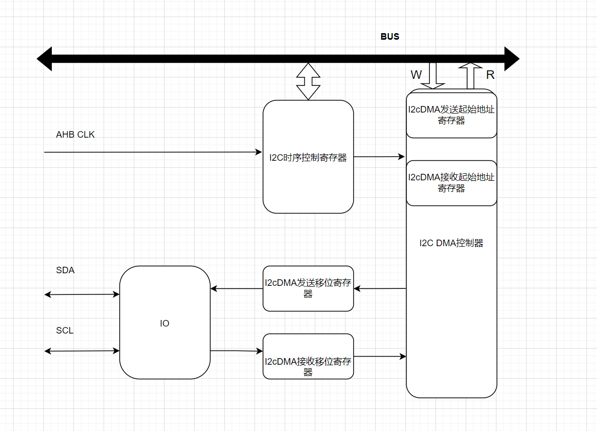
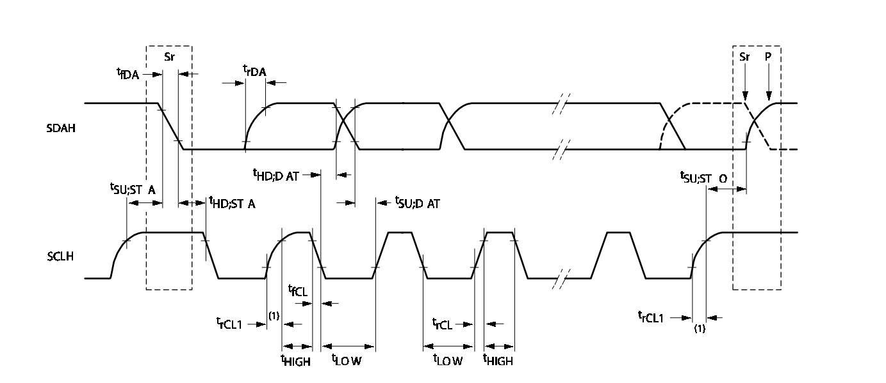

## I2C

### I2C简介

IIC(芯片间)总线接口连接微控制器和串行IIC总线。它提供多主机功能，控制所有IIC总线特定的
时序、协议、仲裁和定时。支持标准和快速两种模式。根据特定设备的需要，使用DMA传输。

### 功能描述

I2C 接口的内部模块框图如下所示：



#### I2C波特率设定



I2c 挂载ahb总线上，采样时钟为ahb 总线时钟。

波特率由数据高(sclh)低(scll)电平的保持时间设定，f = ahbclk/(scll+sclh+8)

若高低电平设定时间一致，  则 scll = sclh =((ahbclk/f) - 8)/2

* scll(0xf911c[7:0]) 设置低电平保持时间 t*LOW*
* sclh(0xf911c[15:8])设置高电平保持时间 t*HIGH*
* stsu(0xf911c[23:16])设置起始位建立时间 t*SUSTA*
* sthd(0xf911c[31:24])设置起始位保持时间 t*HDSTA*
* sosu(0xf9120[7:0])设置停止位建立时间 t*SUSTO*
* dtsu(0xf9120[15:8])设置数据位建立时间 t*SUDAT*
* dthd(0xf9120[24:8])设置数据位保持时间 t*HDDAT*

详细时间参数要求见“I2C总线协议规范”

#### I2c时序控制

restart(0xf9120[24]) 控制i2c 协议中restart时序，写从设备时置0，读从设备时置1。

#### I2C DMA操作步骤

##### 初始化(i2c0)

* 配置I2C_CTRL0(0xf991c)与I2C_CTRL1(0xf9920) 中时序控制寄存器来确保I2C时序
* 复位I2C DMA读写指针，0xf910f[5]置1再置0

##### 发送数据

* 0xf9120[24] 置 0，准备写数据
* 设置 I2C dma 发送源地址 0xf9100 = addr
* 设置 I2C dma 发送长度 (高位 0xf910d[7:4] = len >> 16, 低位 0xf9108[31:16] = len & 0xfffff)
* 设置 I2C dma 接收长度 (高位 0xf910d[3:0] = 0, 低位 0xf9108[15:0] = 0)
* 启动 I2c dma 0xf910f[7] = 1
* 等待发送完成，while(0xf9110 != 1)

##### 接收数据

* 0xf9120[24] 置 1，准备读数据
* 设置 I2C dma 发送源地址 0xf9100 = addr
* 设置 I2C dma 接收目标地址 0xf9104 = addr
* 设置 I2C dma 发送长度 (高位 0xf910d[7:4] = len >> 16, 低位 0xf9108[31:16] = len & 0xfffff)
* 设置 I2C dma 接收长度 (高位 0xf910d[3:0] = len >> 16, 低位 0xf9108[15:0] = len&0xffff)
* 启动 I2c dma 0xf910f[7] = 1
* 等待接收完成，while(0xf9110 != 1)

### 典型示例

**I2C0 初始化**

```
static void I2C_Configuration(void)
{
    I2C_InitTypeDef I2C_InitStruct;

    if (I2Cx == I2C0PORT)
    {
        GPIO_Config(I2C0SCL_PORT, I2C0SCL_IO_PIN, I2C0_SCL|PULL_PU);
        GPIO_Config(I2C0SDA_PORT, I2C0SDA_IO_PIN, I2C0_SDA|PULL_PU);
    }
    else if (I2Cx == I2C1PORT)
    {
        GPIO_Config(I2C1SCL_PORT, I2C1SCL_IO_PIN, I2C1_SCL);
        GPIO_Config(I2C1SDA_PORT, I2C1SDA_IO_PIN, I2C1_SDA);
    }

    I2C_InitStruct.scll = SCLL_100KHZ;
    I2C_InitStruct.sclh = SCLH_100KHZ;
    I2C_InitStruct.stsu = STSU_100KHZ;
    I2C_InitStruct.sthd = STHD_100KHZ;
    I2C_InitStruct.sosu = SOSU_100KHZ;
    I2C_InitStruct.dtsu = DTSU_100KHZ;
    I2C_InitStruct.dthd = DTHD_100KHZ;

    I2C_Init(I2Cx, &I2C_InitStruct);

```

**读写EEPROM**

```
/**
 * @brief Send data to `eeprom128k` and receive from `eeprom128k`.
 *        The address of `eeprom128k` is 0xA0.
 */
static void I2C_SendReceiveBytes_Test()
{
    unsigned int i;
    uint8_t write_msg[WCMD_LEN + ARRAY_LEN] = {0}, read_msg[RCMD_LEN] = {0};
    uint8_t recv_data[ARRAY_LEN] = {0};

    /* Config write and read commad */
    I2C_Init_Eeprom_CMD(write_msg, FALSE, 0x00, 0x00);
    I2C_Init_Eeprom_CMD(read_msg,  TRUE,  0x00, 0x00);

    /* Fill array with sequential number */
    for (i = 0; i < ARRAY_LEN; i++)
    {
        write_msg[WCMD_LEN + i] = i;
    }
    I2C_SendBytes(I2Cx, write_msg, WCMD_LEN + ARRAY_LEN);

    /* It needs wait a while between write and read */
    sleep_for_while(0xffff);

    I2C_ReceiveBytes(I2Cx, read_msg, RCMD_LEN, recv_data, ARRAY_LEN);
    /* Check if received data is same with send data */
    for (i = 0; i < ARRAY_LEN; i++)
    {
        if (write_msg[WCMD_LEN + i] != recv_data[i])
        {
            break;
        }
    }

    I2C_Test_Result_Print(write_msg, recv_data, (Boolean)(i == ARRAY_LEN));
}
```

### FEQ常见问题

#### I2c能不能做slave？

不能。

#### 连续发送数据出错

把sosu停止位建立时间配小
