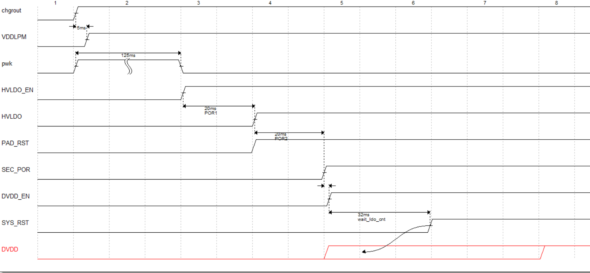
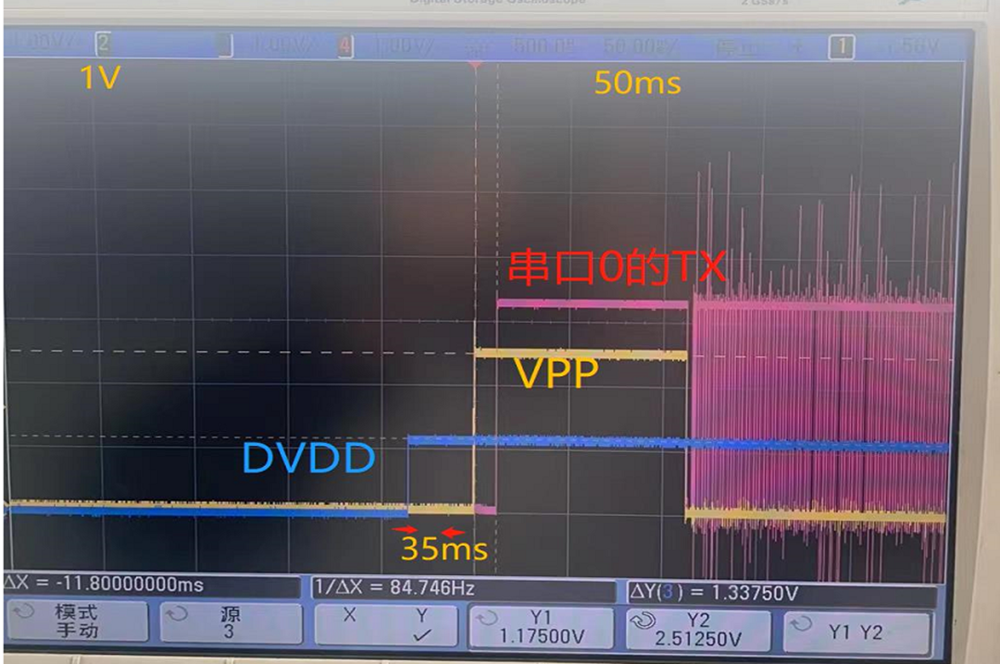
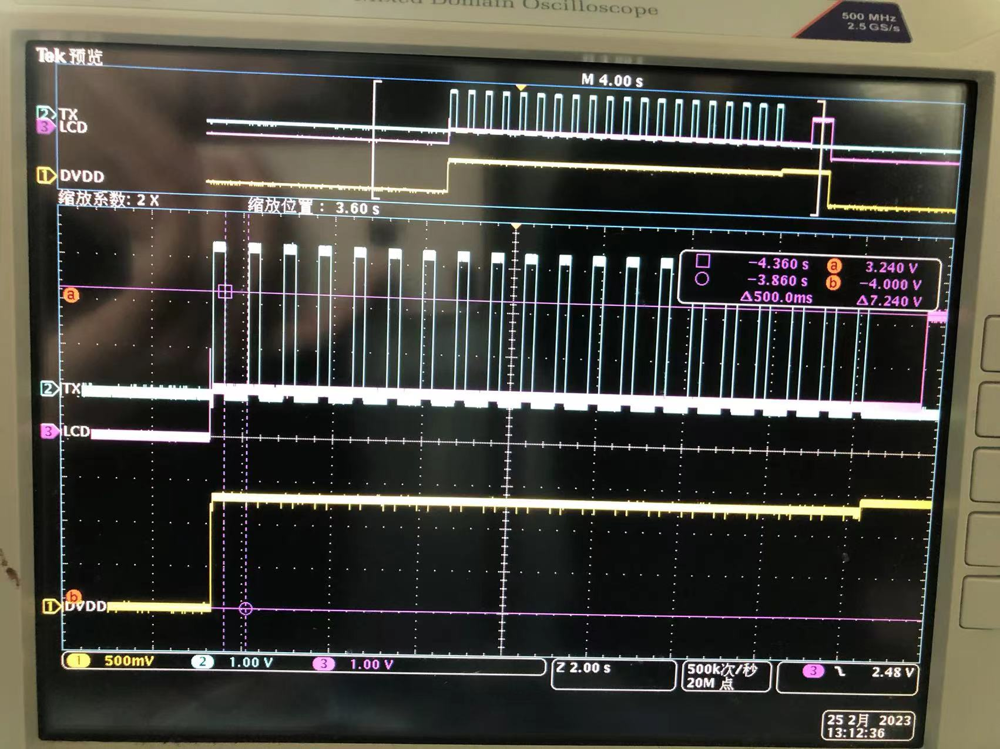
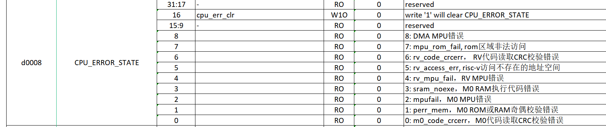

## PWR

### PWR简介

电源控制PWR(Power Controller)主要涉及芯片的供电系统、电源管理器和低功耗模式等功能。

### 供电系统

芯片有5个电源输入口：

CHGRIN 作为 ChargerModule (充电模块)的输入，也作为内部LDO的输入。

CHGROUT 作为 ChargerModule 的输出，也作为内部 LDO 的输入。

VBUT 作为备份域LDO输入。

VIO 作为IO工作电源输入。

VIO2 作为特殊IO工作电源输入。


4个电源输出口：

HVOUT：作为内部LDO3.3v 输出 与内部MCU主电源输入AVDD33_SEC 绑定一起。

DVDD：作为core ldo 的输出，给芯片内核，内存，OSC192M，PLL，及外设模块供电。

VDDLPM: 作为备份域 ldo的输输出，给备份域内存，OSC32K，Sensor，Tamper供电。

### **电源管理**

* HVOUT 电压调节器：

  * LPM域下寄存器**0xfae88[3:0]**，默认值8，50mv 一个step，ft量厂会校准该电压范围3.25~3.35。
  * LPM域下寄存器**0xfa800[0]**，默认值0，调节HVOUT最大电流的输出。
* DVDD 电压调节器：LPM域下寄存器**0xfa800[15:12]**, 默认值d，100mv一个step，ft量厂会校准该电压范围1.27~1.39。
* POR(power on reset)上电复位：

  

### 低功耗模式

芯片有3种低功耗模式：包括浅睡模式，深睡模式，关机模式。

#### 浅睡模式

DVDD 域以低压低功耗模式工作，cpu进入睡眠模式(WFI)，内存，外设都以低功耗模式工作，所有的IO引脚都保持在设置的状态，中断事件发生后，睡眠模式立即唤醒，继续工作。

#### **深睡模式**

DVDD 域被切断，RC192M震荡器被关闭，RAM和寄存器内容丢失，只有备份域的模块继续工作，事件唤醒后芯片将复位。

#### **关机模式**

HVOUT稳压器被关闭，只有备份域的模块继续工作。

### 功耗数据

一般根据最低电源消耗，最快启动时间和可用的唤醒源等条件，选择一种最佳的低功耗模式。相关参数可以参考各系列对应的数据手册，如下数据从数据手册摘取。

#### 典型电流消耗

| 模式     | 状态                                                      | 主电源功耗 | 备份域功耗 |
| -------- | --------------------------------------------------------- | ---------- | ---------- |
| 运行模式 | 常温,dvdd1.4v,mcu clk48MHz                                | 8.57ma     | 0.2ua      |
| 浅睡模式 | 常温,dvdd1.2v,mcu clk12M,关闭所有外设clk,设置powkey高唤醒 | 1.7ma      | 0.2ua      |
| 深睡模式 | 常温,备份域传感器全开,DVDD域下电,设置RTC/IO高电平唤醒     | 7ua        | 0.2ua      |
| 关机模式 | 常温,备份域传感器全开,Hvout下电                           | 1.7ua      | 0.2ua      |

#### 典型唤醒时间

| 模式     | 状态               | 时间                                        |
| -------- | ------------------ | ------------------------------------------- |
| 浅睡模式 | powerkey高电平唤醒 | 无                                          |
| 深睡模式 | GPIO高电平唤醒     | sysrest timer(32ms)                         |
| 关机模式 | powerkey高电平开机 | pwk+por1+por2+sysrest timer(125+20+20+32)ms |

### 典型休眠示例

* **powerkey 高电平休眠唤醒示例（代码参考lightsleep demo）**

  ```
  //使能Powerkey高电平中断
      NVIC_EnableIRQ(POWER_IRQn);
      NVIC_SetPriority(POWER_IRQn, 1);
      PWK_InterruptType(HIGH);
      PWK_ITEnable(ENABLE);
  //配置唤醒源,0xd0004[31:0] 唤醒中断源设置,每1bit对应0~31号中断
      SYSCTRL_LightSleepWakeSrcIT((1 << POWER_IRQn), ENABLE);
  //进入休眠前准备
  SYSCTRL_LightSleep
  {
  //获取当前mcu,ahb时钟频率,唤醒后恢复
  //关闭随机数
  //关闭不使用的io
  //关闭中断
  //获取otp中休眠core电压 dvdd配置
  //获取当前使能的外设时钟,唤醒后恢复
  //预加载进入休眠的code,避免低压load code出错
  //进入休眠api
  //降cpu,ahb频率，关闭所有外设clk,降低dvdd,关闭外部晶体
  //使能WFI_en,使能lightsleep_en
  //nop
  //进入wfi
  //等待中断事件,唤醒恢复以上
  }

  ```

### **FEQ常见问题**

#### **开不了机**

用户层面上的开不了机概念：应用代码没跑起来（屏不亮）

* 基本定位

  * hvout 3.3v? dvdd1.2v? vio3.3?
  * 代码是否跑出了rom boot？
    * e 命令定位（调试口未关闭条件下）
    * 日志输出定位
    * io波形定位
  * 应用开机情况？
    * 如是否有长按powerkey开机检测？
    * 确认 mcu时钟是否为RC？
* 开机波形

  正常波形

  

  #### flash代码异常波形

  

#### **休眠唤不醒**

* 唤醒Core 电压 dvdd是否正常？

  * 低于1.2v 高频下会出异常
  * 低于1.0v 读otp会出异常
* 唤醒源是否配置正常？

  * 测试唤醒中断能否正常触发
* 时钟切换是否正常？

  * 时钟切换需前后两个时钟都有
  * 切换后执行nop 指令是等待时钟稳定

#### 系统复位

* 读取0xd0008寄存器看异常值

  
* hardfult 中断
* wdt中断
